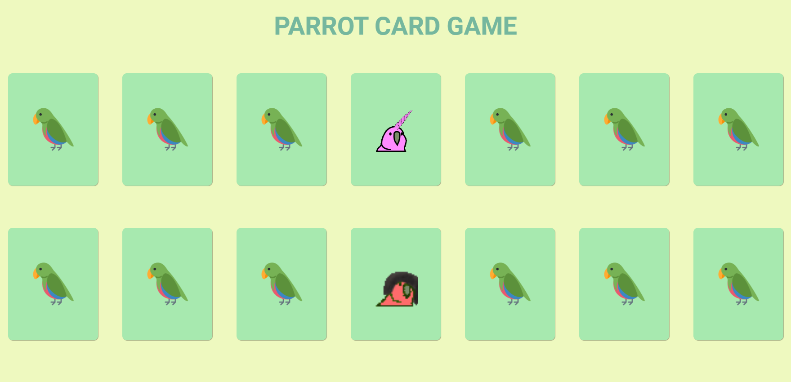

<h1 align="center">Projeto Parrots Game </h1>

<p align="justify">Esse desafio, foi desenvolver a aplicação do jogo da memória Parrots a partir de um layout, colocando em prática tudo o que aprendi.</p>
<hr/>
✅ Requisitos

- Geral
    - [x]  Não utilize nenhuma biblioteca para implementar este projeto (jQuery, lodash, React, etc), nem outras linguagens que compilem para JS (TypeScript, ELM, etc), somente JavaScript puro.
    - [x]  Seu projeto deverá ser desenvolvido utilizando Git e GitHub, em um repositório público.
    - [x]  A cada requisito implementado faça um *commit* com uma mensagem descritiva do que você evoluiu.
- Layout
    - [x]  Aplicar *layout* para *desktop* e *mobile*, seguindo o Figma.
- Distribuição de cartas
    - [x]  Ao entrar no jogo, o usuário deverá ser perguntado com quantas cartas quer jogar (utilize `prompt`).
    - [x]  O usuário só poderá inserir números pares no `prompt`, de 4 a 14. Qualquer número que fuja dessa regra não deve ser aceito. No caso de números inválidos, o `prompt` deverá ficar sendo repetido em loop, até que o usuário coloque um número válido.
    - [x]  Após inserir um número de cartas válido, o jogo deverá inserir as cartas viradas pra baixo na página de forma que a distribuição seja aleatória.
        
        🔥 Dica: para embaralhar uma array, utilize o código abaixo:
        
        ```jsx
        minhaArray.sort(comparador); // Após esta linha, a minhaArray estará embaralhada
        
        // Esta função pode ficar separada do código acima, onde você preferir
        function comparador() { 
        	return Math.random() - 0.5; 
        }
        ```
        
- Imagens dos parrots
    - [x]  É obrigatório que tanto a imagem do papagaio virado pra baixo quanto a imagem virada pra cima (gif) sejam implementadas como tag `` (não deve ser um background).
        - OBS: a carta em si pode ser uma `<div>`, somente a imagem do papagaio que deve ser uma ``.
    - [x]  Papagaios iguais devem necessariamente usar a mesma imagem como base (não podem ser arquivos diferentes para um mesmo papagaio).
- Clique na carta
    - [x]  Ao clicar em uma carta, ela deve ser virada.
    - [x]  Caso seja a primeira carta do par, ela deve permanecer virada até o usuário escolher a segunda carta.
    - [x]  Caso seja a segunda carta virada, existem duas situações:
        - [x]  Caso seja igual à primeira carta, o usuário acertou e ambas agora devem ficar viradas pra cima até o final do jogo;
        - [x]  Caso seja uma carta diferente da primeira carta virada, o usuário errou. Nesse caso, o jogo deve **aguardar 1 segundo** e então virar as duas cartas para baixo novamente.
    - [x]  **Dica**: se quiser fazer o efeito 3D da carta virando, você pode ver o CSS necessário em: [https://repl.it/@BootcampRespond/FlippedCards#index.html](https://repl.it/@BootcampRespond/FlippedCards#index.html) . Só se atente que nesse exemplo a carta vira ao passar o mouse. No caso do jogo, seria ao clicar.
- Fim do jogo
    - [x]  Quando o usuário terminar de virar todas as cartas corretamente, **deverá** ser exibido um `alert` com a mensagem `Você ganhou em X jogadas!`, sendo X a quantidade de vezes que o usuário virou uma carta no jogo, ou seja, cada carta virada é uma jogada, não é virar duas cartas que é uma jogada.
- **Para o avaliador HUB**
    
    Para a correção do projeto, é necessário seguir os requisitos abaixo:
    
    - [x]  **A página HTML do projeto deve se chamar `index.html` e deve estar na raiz do projeto**. Qualquer arquivo com outro nome não funcionará.
    - [x]  Atente-se para a mensagem final do alert de vitória do jogo. A escrita deve ser idêntica ao que foi pedido.
    - [x]  Atente-se para o requisito que solicita que os parrots devem usar a tag ``.
    - [x]  Você deverá incluir no seu código os atributos `data-test` nos elementos indicados no Figma a seguir.
<hr/>

## 🛠 &nbsp;Skills
<div align="center">
  
  
  
          
  
                                     
</div>
<hr/>

## 🚀 &nbsp;Links

- [Figma](https://www.figma.com/file/EBizkrjH73Ku9fmib49Hlm/Parrot-Card-Game?node-id=0%3A1&t=pb5YhpnesSOtw1Ic-0).<br/>
- [Deploy](https://projeto4-parrots-taupe.vercel.app/).<br/>
___

## 💬 &nbsp;Contact


Feito por [Raissa Curty](https://github.com/curtyraissa)!

<a href="https://www.linkedin.com/in/raissa-curty/" target="_blank">
    
  </a>&nbsp;
